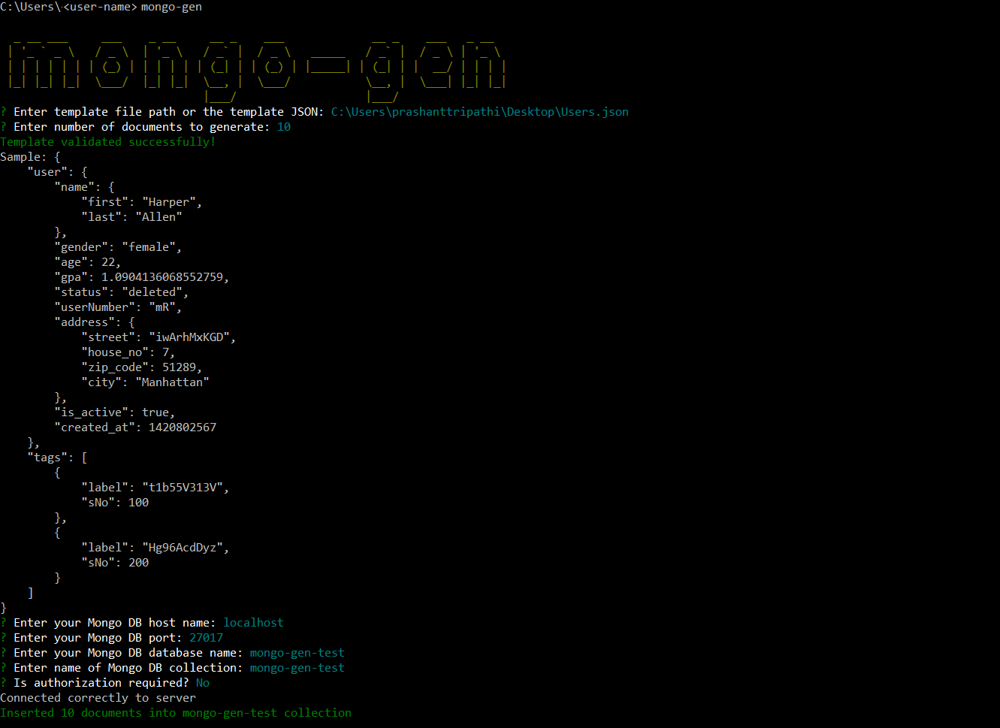

# mongo-gen

This is a es6 port of python `mgenerate` of mtools family. It will generate structured, semi-random data according to a 
template document. 
It offers an interactive command line tool which takes template and mongo-db details as user input.
The format for the template argument is in JSON.

# Usage

# Parsing the JSON document

All values are taken literally, except for special $-prefixed values.

These values can be simple strings, or documents. Simple strings can be used if none of the additional options need to be specified. To customize the behavior of a command, use the document style.

    { "_id": "$command" }
    { "_id": { "$command": { <additional options> } } }

Note that we are writing JSON, so field names have to be strings, the quotes cannot be left out.

Some commands have a shortcut syntax, taking an array as their only value to the command key. This array syntax is always only syntactic sugar for their most common use case, and there is always a (more verbose) document-style syntax that will achieve the same. Each command section will specify exactly what the array-syntax means.
    
    { "_id": { "$command": [ <additional options> ] } }

### `$objectid`

Creates an ObjectId(). Alias is `$oid`.

> ##### Example
>     
>     { "_id" : "$objectid" }
> 
> This command replaces `"$objectid"` with a proper newly generated ObjectId.

#### Additional Parameters

None

### `$number`

Creates a random number.

> ##### Example
>     
>     { "age" : "$number" }
> 
> This command replaces `"$number"` with a uniformly random number between 0 and 100.

#### Additional Parameters

###### lower and upper bounds
`{ "$number" : {"min" : 500, "max" : 1000 } }`  

Generate a uniformly random number between the `min` and `max` values (both ends inclusive). Either parameter can be omitted, the fall-back is the default (0 for lower bound, 100 for upper bound). If `min` > `max`, the tool will throw an error.

#### Array Syntax
`{ "$number" : [ MIN, MAX ] }`  

Short form for `{ "$number" : {"min" : MIN, "max" : MAX } }`.

### `$datetime`

Creates a random date and time. Alias is `$date`.

> ##### Example
>     
>     { "_id" : "$datetime" }
> 
> This command replaces `"$datetime"` with a randomly generated date between Jan 1, 1970 0:00:00.000 (Epoch 0) and now. 

#### Additional Parameters

###### lower and upper bounds
`{ "$datetime" : {"min" : 1358831035, "max" : 1390367035 } }`  

Generate a random date and time between the `min` and `max` values (both ends inclusive).

`min` and `max` values can be epoch numbers (see example above). They can also be strings that can be parsed as date (and optionally time), e.g. "2013-05-12 13:30". 

#### Array Syntax
`{ "$datetime" : [ MIN, MAX ] }`  

Short form for `{ "$datetime" : {"min" : MIN, "max" : MAX } }`.

### `$missing`

Will not insert the key/value pair. A percentage of missing values can be specified.

> ##### Example
>     
>     { "name" : "$missing" }
> 
> This will cause the entire key/value pair with key "name" to be missing.

#### Additional Parameters

###### Missing Percentage
`{ "$missing" : { "percent" : 30, "ifnot" : VALUE } }`  

Will cause the key/value pair to be missing 30% of the time, and otherwise set the VALUE for the given key.

### `$choose`

Chooses one of the specified values. 

> ##### Example
>     
>     { "status" : { "$choose" : { "from" : [ "read", "unread", "deleted" ] } } }
> 
> Will pick one of the values from the array with equal probability.

#### Additional Parameters

###### Ratio 
`{ "$choose" : { "from" : [ VAL1, VAL2, ... ], "weights": [ W1, W2, ... ] } }`  

Will pick the values proportionally to the given weights. The `weights` array must be the same length as the `from` array.

> ##### Example
>     
>     { "status" : { "$choose" : { "from" : [ "read", "unread", "deleted" ], "weights" : [ 1, 1, 10 ] } } }
> 
> Will pick one of the values from the array. Will pick "deleted" 10 times more likely than read and unread.

#### Array Syntax
`{ "$choose" : [ VAL1, VAL2, ... ] }`  

Short form for `{ "$choose" : { "from" : [ VAL1, VAL2, ... ] } }`.

### `$array`

Builds an array of elements of given length. Can be combined with $number to create random-length arrays.

> ##### Example
>     
>     { "friends" : { "$array" : { "of": "$oid", "number": 20 } } }
> 
> This will create an array for friends containing 20 unique ObjectIds.

#### Array Syntax
`{ "$array" : [ VALUE, NUMBER ] }`  

Short form for `{ "$array" : { "of" : VALUE, "number" : NUMBER } }`.
